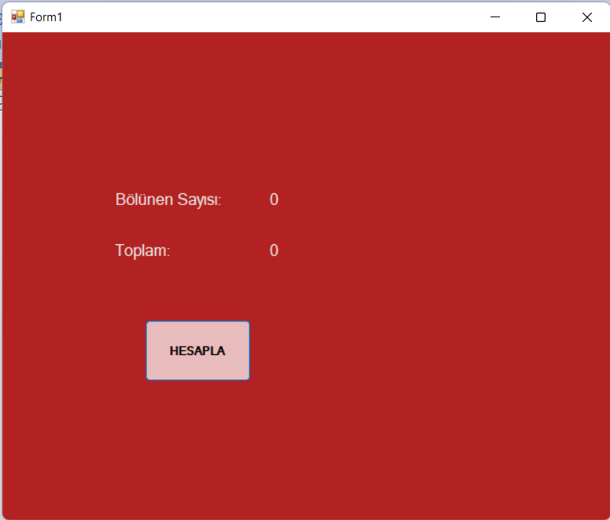

This is a very simple code to ease into C# programming. 
Basically, after the button click it calculates the numbers of divisors of 7 between 0 and 25, then prints both this number and the sum of these divisors.

